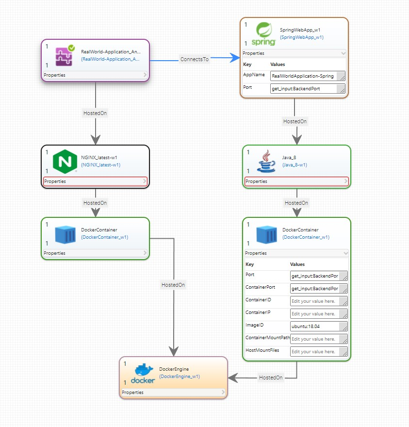

# TOSCA Definitions Common Repository [](https://opensource.org/licenses/Apache-2.0)

> Common TOSCA definitions (e.g., VMs, cloud providers, and runtimes) prepared for being consumed by a TOSCA-compliant engine, such as the [OpenTOSCA Container](http://opentosca.github.io/container).

## Usage

This repository uses [git lfs](https://git-lfs.github.com/) as it contains large binary files which are not checked in to the git tree.
Therefore, make sure that
  1. you have an active git lfs installation on your machine,
  2. run `git lfs install` directly after cloning the repository inside the cloned folder, and
  3. run `git lfs pull` to download the binary files.

⚠️ If the lfs-files are not downloaded, the repository, and thus the modeled applications, cannot run! 
Thus, ensure you run `git lfs pull`.

💡 To install git lfs globally, run `git lfs install --system`. 
This makes git lfs automatically available for all repositories, and you do not have to run git lfs pull yourself.

## Implementation Artifact Development

In general, TOSCA Implementation Artifacts (IAs) can be implemented in two ways:
1. as a webservice that can be deployed dynamically by a TOSCA orchestrator
2. as scripts that can be executed on a target machine.

If input variables are needed in an IA from the application's Topology Template, they must be defined as Input Parameters at the corresponding Node Type's operation which the IA is implementing.
For example, if you need the `Port` property to start the SpringWebApp shown in the figure below, make sure that the corresponding operation defines `Port` as its input parameter and that the case matches.



### Service Development

To develop a new webservice IA using java, you can see the [DockerEngine Interface](artifacttemplates/http%3A%2F%2Fopentosca.org%2Fartifacttemplates/DockerEngine_DockerEngine-Interface-w1) as an example.
We use Java 17, Spring and Maven to build a SOAP webservice that can be invoked by the [OpenTOSCA Orchestrator](https://github.com/OpenTOSCA/container).

To follow current DevOps principles, we use GitHub Actions to test and build the webservice IAs.
Therefore, we added a multi-stage build which can be easily extended to automatically build and test the new IA automatically.
For example, to automatically build the DockerEngine Interface, there is this entry in the [serviceArtifactsCI workflow](.github/workflows/serviceArtifactsCI.yml):

```yaml
strategy:
  matrix:
    artifactTemplates:
      - name: DockerEngine-Interface
        path: artifacttemplates/http%3A%2F%2Fopentosca.org%2Fartifacttemplates/DockerEngine_DockerEngine-Interface-w1
```

To enable the automated build of a new IA, simply add a new entry to the `artifactTempaltes` with the `name` of the IA and
the `path` to the root of the Artifact Template that describes this IA.

⚠️The `path` must point to the root of the Artifact Template, **NOT** the `source` folder - it is automatically added by the build.

For example, if a new `DummyIA` is added under the path `artifacttemplates/encoded_namespace/DummyIA`, the resulting artifactTemplates in the [serviceArtifactsCI workflow](.github/workflows/serviceArtifactsCI.yml) will contain:

```yaml
strategy:
  matrix:
    artifactTemplates:
      - name: DockerEngine-Interface
        path: artifacttemplates/http%3A%2F%2Fopentosca.org%2Fartifacttemplates/DockerEngine_DockerEngine-Interface-w1
      - name: DummyIA
        path: artifacttemplates/encodec_namespace/DummyIA-w1
```

### Script Development

To deploy, e.g., a MySQL database management system onto a virtual machine (VM), a bash script, in case the VM is running an Ubuntu operating system (OS), can be used.
In this case, the script may simply be used to run: 

```bash
apt get update
apt get install mysql
```

If you need the input variables defined at the operation, you can simply use them as variables.
They are automatically set by the OpenTOSCA Orchestrator when executing the script.
For example, if the operation you are implementing defines the input parameters `VMIP` and `Port`, you can access them in the bash script as follows:

```bash
echo "Got value for the IP: $VMIP"
echo "Got value for the port: $Port"
```

⚠️The input parameters are case-sensitive! Thus, check that the case matches the input parameters definition in the script.

## Haftungsausschluss

Dies ist ein Forschungsprototyp und enthält insbesondere Beiträge von Studenten.
Diese Software enthält möglicherweise Fehler und funktioniert möglicherweise, insbesondere bei variierten oder neuen Anwendungsfällen, nicht richtig.
Insbesondere beim Produktiveinsatz muss 1. die Funktionsfähigkeit geprüft und 2. die Einhaltung sämtlicher Lizenzen geprüft werden.
Die Haftung für entgangenen Gewinn, Produktionsausfall, Betriebsunterbrechung, entgangene Nutzungen, Verlust von Daten und Informationen, Finanzierungsaufwendungen sowie sonstige Vermögens- und Folgeschäden ist, außer in Fällen von grober Fahrlässigkeit, Vorsatz und Personenschäden ausgeschlossen.

## Disclaimer of Warranty

Unless required by applicable law or agreed to in writing, Licensor provides the Work (and each Contributor
provides its Contributions) on an "AS IS" BASIS, WITHOUT WARRANTIES OR CONDITIONS OF ANY KIND, either express
or implied, including, without limitation, any warranties or conditions of TITLE, NON-INFRINGEMENT,
MERCHANTABILITY, or FITNESS FOR A PARTICULAR PURPOSE. You are solely responsible for determining the
appropriateness of using or redistributing the Work and assume any risks associated with Your exercise of
permissions under this License.
